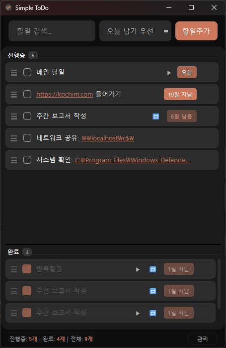
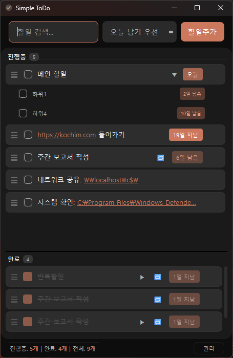
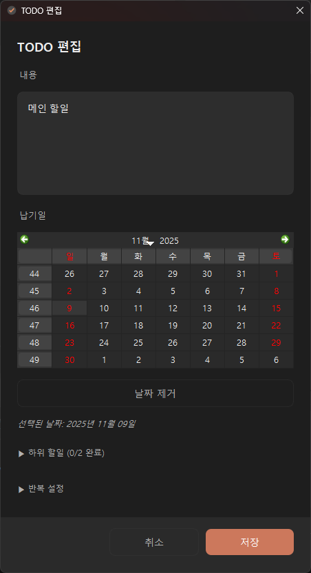
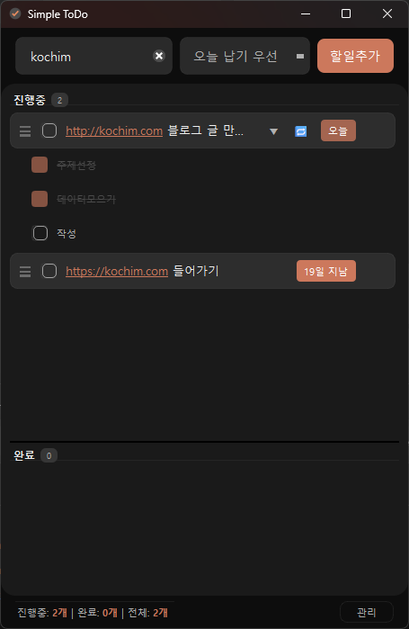

# Simple ToDo

> **화면의 1/4 크기로 실행되는 심플하고 우아한 할일 관리 데스크톱 애플리케이션**


[](https://github.com/gyh214/simple-todo/releases/latest)

---

## 📸 메인 화면

<p align="center">
  
</p>

---

## ✨ 주요 특징

Simple ToDo는 **완벽함보다는 심플함**을 추구합니다. 복잡한 기능 없이 핵심만 담아 할일을 효율적으로 관리할 수 있습니다.

- 🎨 **다크 모드 테마** — 눈의 피로를 줄이는 세련된 UI
- 📌 **항상 위** — 작업 중에도 화면에 고정 가능
- 📝 **할일 생성** — 간단한 텍스트 입력으로 빠르게 추가
- 🔄 **하위 할일** — 복잡한 작업을 단계별로 나누어 관리
- 📅 **반복 할일** — 매일/매주/매달 자동으로 생성
- 🔍 **검색 & 정렬** — 필요한 할일을 빠르게 찾고 정렬
- 💾 **자동 백업** — 모든 변경사항 즉시 저장 및 안전한 백업
- 🖥️ **시스템 통합** — 최소화 시 트레이로 이동

---

## 📸 기능 갤러리

### 하위 할일로 복잡한 작업 관리

<p align="center">
  
</p>

**큰 프로젝트를 작은 단계로 분할합니다.** 각 하위 할일의 진행 상태를 보면서 전체 진행률을 한눈에 파악할 수 있습니다.

---

### 직관적인 편집 화면

<p align="center">
  
</p>

**모든 기능이 한 화면에 있습니다.** 내용, 납기일, 하위 할일, 반복 설정을 한 곳에서 관리할 수 있습니다.

---

### 강력한 검색 & 정렬

<p align="center">
  
</p>

**필요한 할일을 즉시 찾습니다.** 실시간 검색과 다양한 정렬 옵션으로 할일을 효율적으로 관리합니다.

---

## 🚀 빠른 시작

### Windows 사용자 (권장)

1. [최신 릴리스](https://github.com/gyh214/simple-todo/releases/latest)에서 `SimpleTodo.exe` 다운로드
2. 원하는 위치에 저장하고 실행
3. 끝! 🎉

### 개발자 (소스 코드 실행)

```bash
# 1. 저장소 클론
git clone https://github.com/gyh214/simple-todo.git
cd new-todo-panel

# 2. 가상환경 설정
python -m venv venv
venv\Scripts\activate

# 3. 의존성 설치
pip install -r requirements.txt

# 4. 실행
python main.py
```

더 자세한 설치 방법은 [설치 가이드](docs/USER_GUIDE.md#설치-및-실행)를 참고하세요.

### 🔧 실행 옵션

Simple ToDo는 **기본 모드**와 **디버그 모드** 두 가지 실행 방식을 지원합니다.

#### 기본 실행 (권장)
```bash
SimpleTodo.exe
```
- **로그 파일**: 임시 폴더(`%TEMP%`)에 생성 → 프로그램 종료 시 자동 삭제
- **용도**: 일반 사용자의 일상적인 사용
- **장점**: 디스크 공간 절약, 로그 파일 관리 불필요

#### 디버그 모드 실행
```bash
SimpleTodo.exe --debug
```
- **로그 파일**: exe 폴더의 `logs\` 디렉토리에 생성 → 계속 유지
- **용도**: 문제 발생 시 로그 파일 분석, 개발자 디버깅
- **장점**: 상세한 로그 파일로 문제 원인 파악 용이

#### 로그 파일 위치 비교

| 구분 | 경로 | 자동 삭제 | 용도 |
|------|------|----------|------|
| 기본 모드 | `%TEMP%\SimpleTodo_XXXX\app.log` | 종료 시 자동 삭제 | 일반 사용 |
| 디버그 모드 | `SimpleTodo.exe 위치\logs\app_YYYYMMDD_HHMMSS.log` | 유지 | 문제 분석 |

> **팁**: 문제가 발생했을 때는 `SimpleTodo.exe --debug` 옵션으로 다시 실행한 후 logs 폴더의 로그 파일을 확인하면 문제를 쉽게 찾을 수 있습니다.

---

## 💡 주요 기능 상세

### 📝 할일 관리

- **간단한 생성**: 텍스트를 입력하고 Enter 키만 누르면 추가됨
- **빠른 완료**: 체크박스를 클릭하여 완료 상태 변경
- **즉시 삭제**: ✕ 버튼으로 불필요한 할일 제거
- **납기일 시각화**: 색상으로 우선순위 구분 (빨강=만료, 주황=오늘, 파랑=여유)

### 🎯 하위 할일

- **작업 분할**: 복잡한 할일을 여러 단계로 나눔
- **진행률 표시**: "2/5" 형식으로 현재 진행 상황 파악
- **펼침 상태 유지**: 완료/삭제 후에도 펼친 상태 자동 유지

### 🔄 반복 할일

- **자동 생성**: 매일/매주/매달 반복되는 할일 자동 생성
- **편리한 설정**: 편집 화면에서 반복 주기만 선택
- **유연한 관리**: 반복 일정 변경 또는 취소 가능

### 🔍 검색 & 정렬

- **실시간 검색**: 입력 중 즉시 검색 결과 표시
- **4가지 정렬**: 생성순, 납기일(빠름/늦음), 커스텀 순서

---

## 📚 도움말 & 가이드

| 문서 | 설명 |
|------|------|
| 📖 [사용자 가이드](docs/USER_GUIDE.md) | 상세 사용법, 키보드 단축키, 문제 해결 |
| 🛠️ [개발 가이드](CONTRIBUTING.md) | 개발 환경 설정, 코드 기여 방법 |
| 📝 [변경 이력](CHANGELOG.md) | 버전별 업데이트 내용 |
| 📧 [문의하기](../../issues) | 버그 리포트, 기능 제안 |

---

## 🔒 보안 & 프라이버시

Simple ToDo는 **개인정보 보호**와 **투명성**을 최우선으로 설계되었습니다.

### 당신의 데이터는 안전합니다

- **완전 로컬 저장**: 모든 할일 데이터는 당신의 컴퓨터에만 저장됩니다. 클라우드 연동이 없습니다.
- **개인정보 수집 없음**: 이메일, 이름, 개인정보를 수집하지 않습니다.
- **네트워크 통신 최소화**: GitHub 업데이트 확인 외에는 외부와 통신하지 않습니다.
- **오픈소스 검증**: [GitHub 저장소](https://github.com/gyh214/simple-todo)에서 모든 코드를 공개합니다. 누구나 코드를 검사하여 안전성을 확인할 수 있습니다.
- **SQLite 로컬 데이터베이스**: 모든 데이터는 로컬 SQLite 데이터베이스에 저장되며, 백업도 로컬에서만 진행됩니다.

### Windows Defender 경고 안내

**"알 수 없는 게시자" 경고가 표시되나요?**

이는 Simple ToDo가 **코드 서명 인증서**로 서명되지 않았기 때문입니다. 완전히 정상입니다!

- 경고는 앱의 안전성과 무관합니다.
- Simple ToDo는 **오픈소스**이므로 누구나 코드를 검토하여 안전성을 확인할 수 있습니다.
- 이 앱은 어떤 개인정보도 수집하거나 전송하지 않습니다.

**경고를 무시하고 앱을 실행하려면:**
1. Windows Defender 경고 화면에서 "추가 정보" 클릭
2. "실행" 버튼 클릭
3. 앱이 정상적으로 실행됩니다

---

## 🛠️ 기술 정보

| 항목 | 내용 |
|------|------|
| **언어** | Python 3.7+ |
| **GUI** | PyQt6 |
| **아키텍처** | CLEAN Architecture |
| **데이터** | JSON (자동 저장 + 백업) |
| **플랫폼** | Windows 10+ |

---

## 📦 최신 업데이트

### v2.5.1 (2025-11-09) — 자동 업데이트 & 문서화 개선

✨ **개선사항**:
- GitHub Releases 연동 자동 업데이트 기능 추가

👉 [전체 변경 이력](CHANGELOG.md)

---

## 🤝 기여하기

버그 리포트, 기능 제안, Pull Request는 언제나 환영합니다!

자세한 내용은 [기여 가이드](CONTRIBUTING.md)를 참고하세요.

**빠른 시작**:
1. [Issues](../../issues)에서 기존 이슈 확인 또는 새 이슈 생성
2. Fork하여 Feature 브랜치 생성
3. 코드 작성 및 테스트
4. Pull Request 생성

---

## 📝 라이선스

이 프로젝트는 [MIT 라이선스](LICENSE) 하에 배포됩니다.

---

## 📧 문의 및 지원

- **버그 리포트**: [Issues 페이지](../../issues)
- **기능 제안**: [Issues 페이지](../../issues)
- **개발 문의**: [CONTRIBUTING.md](CONTRIBUTING.md) 참고

---

<p align="center">
  <strong>Made with ❤️ for productivity</strong>
  <br>
  <sub>간단함의 힘으로 더 많은 일을 해내세요.</sub>
</p>
