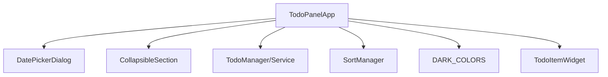
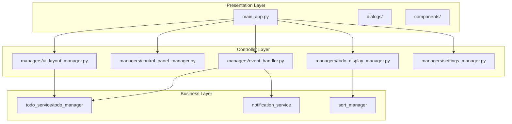

# 🔧 UI/main_app.py 리팩토링 상세 계획서

> **목표**: DRY+CLEAN+Simple 원칙에 따른 체계적 리팩토링
> **대상**: ui/main_app.py (1,952줄)
> **방법론**: Line 단위 분할, 의존성 주입 패턴 유지, 코드 재사용 극대화

---

## 📊 현재 상태 분석

### 파일 크기 및 복잡도 분석
```
📁 ui/main_app.py: 1,952줄 (25,549 토큰)
├── 🗓️ DatePickerDialog: 60~663줄 (603줄, 31%)
├── 📂 CollapsibleSection: 664~737줄 (73줄, 4%)
└── 🏠 TodoPanelApp: 738~1947줄 (1,209줄, 62%)
    ├── __init__: 741~785줄 (45줄)
    ├── UI 설정: 786~1186줄 (401줄)
    ├── 이벤트 처리: 1218~1626줄 (409줄)
    ├── 설정 관리: 1671~1890줄 (220줄)
    └── 기타: 1891~1947줄 (57줄)
```

### 클래스별 책임 분석
| 클래스 | 책임 | 문제점 |
|--------|------|--------|
| **DatePickerDialog** | 날짜 선택 UI | ✅ 단일 책임, 분리 용이 |
| **CollapsibleSection** | 접기/펼치기 UI | ✅ 재사용 가능 컴포넌트 |
| **TodoPanelApp** | 메인 애플리케이션 | ❌ 다중 책임 혼재 (UI+이벤트+설정) |

### 의존성 관계 분석


### 식별된 문제점
1. **단일 책임 원칙 위반**: TodoPanelApp이 UI, 이벤트, 설정, 상태 관리까지 담당
2. **높은 결합도**: UI 구성과 비즈니스 로직이 강하게 결합
3. **유지보수성 저하**: 1,952줄의 거대한 파일로 인한 가독성 문제
4. **확장성 제약**: 새 기능 추가 시 복잡도 기하급수적 증가
5. **테스트 어려움**: 책임이 섞여있어 단위 테스트 구성 복잡

---

## 🎯 리팩토링 목표 (DRY+CLEAN+Simple)

### 🔄 DRY (Don't Repeat Yourself)
- **중복 UI 설정 로직 통합**: 반복되는 위젯 스타일링 코드 모듈화
- **공통 이벤트 처리 패턴 추상화**: 유사한 이벤트 핸들러 패턴 통합
- **설정 저장/로드 로직 표준화**: 중복된 설정 관리 코드 제거

### 🏛️ CLEAN Architecture
- **의존성 주입 패턴 유지**: 기존 서비스/매니저 이중 지원 구조 보존
- **인터페이스와 구현체 분리**: Manager 클래스들의 추상 인터페이스 정의
- **비즈니스 로직과 UI 로직 분리**: Presentation Layer와 Business Layer 명확히 구분

### 🎯 Simple
- **각 클래스/모듈이 하나의 명확한 책임**: Single Responsibility Principle 철저 적용
- **직관적인 모듈 구조**: 기능별 폴더 구조로 탐색 용이성 확보
- **최소한의 인터페이스**: 필요한 메서드만 노출, 복잡도 최소화

---

## 🏗️ 새로운 아키텍처 설계

### 분리된 파일 구조
```
ui/
├── dialogs/
│   └── date_picker_dialog.py          # DatePickerDialog (60~663줄)
├── components/
│   └── collapsible_section.py         # CollapsibleSection (664~737줄)
├── managers/
│   ├── ui_layout_manager.py           # UI 레이아웃 관리 (401줄)
│   ├── control_panel_manager.py       # 제어 패널 관리 (118줄)
│   ├── todo_display_manager.py        # TODO 표시 관리 (87줄)
│   ├── event_handler.py               # 이벤트 처리 (409줄)
│   └── settings_manager.py            # 설정 관리 (220줄)
├── interfaces/
│   └── manager_interfaces.py          # Manager 추상 인터페이스
└── main_app.py                        # 핵심 애플리케이션 로직만 (~200줄)
```

### 아키텍처 패턴


---

## 📝 Line 단위 상세 분할 계획

### 1단계: 독립 컴포넌트 분리

#### **ui/dialogs/date_picker_dialog.py**
```python
# 📋 이동할 라인: 60~663줄 (603줄)
# 📦 포함 내용:
- class DatePickerDialog (전체 클래스)
- _calculate_dynamic_size() (128~175줄)
- _apply_dynamic_sizing() (176~197줄)
- _setup_ui_sections() (198~241줄)
- _setup_main_frame() (242~254줄)
- _setup_header() (255~264줄)
- _setup_todo_display() (265~306줄)
- _setup_text_input() (307~340줄)
- _on_text_change() (341~345줄)
- _setup_calendar_section() (346~361줄)
- _setup_buttons() (362~412줄)
- _setup_calendar() (413~474줄)
- _prev_month() (475~483줄)
- _next_month() (484~492줄)
- _update_calendar() (493~587줄)
- _select_date() (588~604줄)
- _add_without_date() (605~619줄)
- _add_with_date() (620~634줄)
- _remove_date() (635~648줄)
- _cancel() (649~654줄)
- show() (655~663줄)

# 🔗 의존성: tkinter, datetime, DARK_COLORS
# 🎯 책임: 날짜 선택 다이얼로그 UI 및 로직
```

#### **ui/components/collapsible_section.py**
```python
# 📋 이동할 라인: 664~737줄 (73줄)
# 📦 포함 내용:
- class CollapsibleSection (전체 클래스)
- _setup_ui() (674~708줄)
- _toggle_section() (709~722줄)
- get_content_frame() (723~725줄)
- pack() (727~729줄)
- update_title() (731~735줄)

# 🔗 의존성: tkinter, DARK_COLORS
# 🎯 책임: 접기/펼치기 가능한 섹션 UI 컴포넌트
```

### 2단계: TodoPanelApp 분해

#### **ui/managers/ui_layout_manager.py**
```python
# 📋 이동할 라인 및 메서드:
- _setup_window() (786~803줄, 18줄)
- _setup_ui() (804~819줄, 16줄)
- _setup_sections() (909~974줄, 66줄)
- _setup_scrollable_area() (975~1186줄, 212줄)
- _style_paned_window_sash() (1627~1645줄, 19줄)
- _set_initial_pane_ratio() (1646~1670줄, 25줄)
- _on_paned_window_configure() (1938~1946줄, 9줄)
- _save_ui_settings_debounced() (1947~1952줄, 6줄)

# 총 371줄 → 추상화 후 ~300줄 예상

# 🏗️ 관리할 속성:
- sections_paned_window: tk.PanedWindow
- pending_section: CollapsibleSection
- completed_section: CollapsibleSection
- pending_canvas: tk.Canvas
- completed_canvas: tk.Canvas
- pending_scrollable_frame: tk.Frame
- completed_scrollable_frame: tk.Frame

# 🎯 책임: UI 레이아웃 구성 및 관리
class UILayoutManager:
    def setup_window(self, root: tk.Tk) -> None
    def setup_main_layout(self, parent: tk.Widget) -> None
    def setup_sections(self, parent: tk.Widget) -> None
    def setup_scrollable_area(self, parent: tk.Widget, section_type: str) -> tuple
    def style_paned_window(self) -> None
    def handle_window_configure(self, event) -> None
```

#### **ui/managers/control_panel_manager.py**
```python
# 📋 이동할 라인 및 메서드:
- _setup_control_panel() (821~908줄, 88줄)
- _setup_status_bar() (1187~1200줄, 14줄)
- _set_entry_placeholder() (1201~1206줄, 6줄)
- _on_entry_focus_in() (1207~1212줄, 6줄)
- _on_entry_focus_out() (1213~1217줄, 5줄)

# 총 119줄 → 추상화 후 ~100줄 예상

# 🎛️ 관리할 속성:
- entry_var: tk.StringVar
- todo_entry: tk.Entry
- add_btn: tk.Button
- sort_btn: tk.Button
- top_btn: tk.Button
- clear_btn: tk.Button
- info_btn: tk.Button
- sort_dropdown: SortDropdownWidget
- status_label: tk.Label

# 🎯 책임: 제어 패널 UI 구성 및 상태 관리
class ControlPanelManager:
    def setup_control_panel(self, parent: tk.Widget) -> None
    def setup_status_bar(self, parent: tk.Widget) -> None
    def set_entry_placeholder(self) -> None
    def handle_entry_focus(self, event_type: str) -> None
    def update_status(self, message: str) -> None
```

#### **ui/managers/todo_display_manager.py**
```python
# 📋 이동할 라인 및 메서드:
- _load_todos() (1306~1333줄, 28줄)
- _create_todo_widget() (1334~1366줄, 33줄)
- _update_section_titles() (1367~1374줄, 8줄)
- _move_todo_between_sections() (1400~1420줄, 21줄)

# 총 90줄 → 추상화 후 ~80줄 예상

# 📋 관리할 속성:
- todo_widgets: Dict[str, TodoItemWidget]
- pending_widgets: Dict[str, TodoItemWidget]
- completed_widgets: Dict[str, TodoItemWidget]

# 🎯 책임: TODO 아이템 표시 및 섹션 관리
class TodoDisplayManager:
    def load_todos(self) -> None
    def create_todo_widget(self, todo_data: Dict[str, Any], section: str = None) -> TodoItemWidget
    def update_section_titles(self) -> None
    def move_todo_between_sections(self, todo_id: str, completed: bool) -> None
    def refresh_display(self) -> None
```

#### **ui/managers/event_handler.py**
```python
# 📋 이동할 라인 및 메서드:
- _show_add_todo_dialog() (1218~1248줄, 31줄)
- _create_todo_with_date() (1249~1265줄, 17줄)
- _on_sort_changed() (1266~1305줄, 40줄)
- _update_todo() (1375~1399줄, 25줄)
- _delete_todo() (1421~1444줄, 24줄)
- _reorder_todo() (1445~1508줄, 64줄)
- _clear_completed() (1509~1534줄, 26줄)
- _toggle_always_on_top() (1535~1545줄, 11줄)
- _show_about_dialog() (1546~1614줄, 69줄)
- _open_kochim_website() (1615~1626줄, 12줄)
- _on_closing() (1900~1923줄, 24줄)

# 총 343줄 → 추상화 후 ~300줄 예상

# 🎯 책임: 사용자 이벤트 처리 및 액션 실행
class EventHandler:
    def show_add_todo_dialog(self) -> None
    def create_todo_with_date(self, text: str, due_date: str) -> None
    def handle_sort_change(self, option_key: str) -> None
    def update_todo(self, todo_id: str, **kwargs) -> None
    def delete_todo(self, todo_id: str) -> None
    def reorder_todo(self, todo_id: str, move_steps: int) -> None
    def clear_completed_todos(self) -> None
    def toggle_always_on_top(self) -> None
    def show_about_dialog(self) -> None
    def open_website(self, url: str) -> None
    def handle_window_closing(self) -> None
```

#### **ui/managers/settings_manager.py**
```python
# 📋 이동할 라인 및 메서드:
- _save_all_ui_settings() (1671~1734줄, 64줄)
- _save_pane_ratio() (1735~1784줄, 50줄)
- _load_sort_settings() (1785~1834줄, 50줄)
- _load_pane_ratio() (1862~1890줄, 29줄)
- _get_config_file_path() (1835~1861줄, 27줄)

# 총 220줄 → 추상화 후 ~180줄 예상

# 🎯 책임: 애플리케이션 설정 저장/로드 관리
class SettingsManager:
    def save_all_ui_settings(self) -> None
    def save_pane_ratio(self) -> None
    def load_sort_settings(self) -> None
    def load_pane_ratio(self) -> None
    def get_config_file_path(self) -> str
    def save_setting(self, key: str, value: Any) -> None
    def load_setting(self, key: str, default: Any = None) -> Any
```

#### **ui/main_app.py (리팩토링된 버전)**
```python
# 📋 남겨둘 라인 및 메서드:
- import 섹션 (1~59줄 → 정리 후 ~30줄)
- class TodoPanelApp:
  - __init__() (741~785줄 → 간소화 후 ~50줄)
  - run() (1924~1937줄, 14줄)
  - _update_status() (1891~1899줄, 9줄)
  - Manager 위임 메서드들 (~50줄)
  - 의존성 주입 관리 (~50줄)

# 📊 예상 결과: ~200줄 (90% 감소: 1,952줄 → 200줄)

# 🎯 리팩토링된 TodoPanelApp 구조:
class TodoPanelApp:
    def __init__(self,
                 root=None,
                 todo_service=None,
                 notification_service=None,
                 # 새로운 Manager 의존성 주입
                 ui_layout_manager=None,
                 control_panel_manager=None,
                 todo_display_manager=None,
                 event_handler=None,
                 settings_manager=None):
        # 기존 CLEAN 아키텍처 지원 유지
        # Manager 인스턴스 초기화 또는 주입받기

    def run(self) -> None:
        # 애플리케이션 시작

    # Manager 위임 메서드들 (한 줄 위임)
    def load_todos(self) -> None:
        return self.todo_display_manager.load_todos()
```

---

## ✅ 단계별 TODO 체크리스트

### 📦 Phase 1: 독립 컴포넌트 분리 (7개 항목)
- [ ] **1.1** `ui/dialogs/` 디렉토리 생성
- [ ] **1.2** `date_picker_dialog.py` 파일 생성 및 DatePickerDialog 클래스 이동 (60~663줄)
- [ ] **1.3** 의존성 import 정리 (DARK_COLORS, tkinter, datetime 등)
- [ ] **1.4** `ui/components/` 디렉토리 생성
- [ ] **1.5** `collapsible_section.py` 파일 생성 및 CollapsibleSection 클래스 이동 (664~737줄)
- [ ] **1.6** 이동된 모듈들의 import 문 수정 및 순환 참조 검사
- [ ] **1.7** 기능 테스트 및 검증 (날짜 선택, 섹션 접기/펼치기)

### 🏗️ Phase 2: Manager 클래스 생성 (7개 항목)
- [ ] **2.1** `ui/managers/` 디렉토리 생성
- [ ] **2.2** `ui_layout_manager.py` 생성 및 UI 레이아웃 메서드 이동 (371줄)
- [ ] **2.3** `control_panel_manager.py` 생성 및 제어 패널 메서드 이동 (119줄)
- [ ] **2.4** `todo_display_manager.py` 생성 및 TODO 표시 메서드 이동 (90줄)
- [ ] **2.5** `event_handler.py` 생성 및 이벤트 처리 메서드 이동 (343줄)
- [ ] **2.6** `settings_manager.py` 생성 및 설정 관리 메서드 이동 (220줄)
- [ ] **2.7** 각 Manager 클래스의 의존성 주입 인터페이스 설계

### 🏠 Phase 3: TodoPanelApp 리팩토링 (5개 항목)
- [ ] **3.1** TodoPanelApp.__init__ 메서드 간소화 (785줄 → 50줄)
- [ ] **3.2** Manager 인스턴스들을 의존성 주입으로 초기화
- [ ] **3.3** 기존 메서드들을 적절한 Manager로 위임하도록 수정
- [ ] **3.4** CLEAN 아키텍처 패턴 유지 (서비스 vs 매니저 패턴 이중 지원)
- [ ] **3.5** 불필요한 import 및 코드 정리 (59줄 → 30줄)

### 🔗 Phase 4: 의존성 및 인터페이스 정리 (5개 항목)
- [ ] **4.1** 순환 import 검사 및 해결
- [ ] **4.2** 각 Manager 간 인터페이스 정의 (`ui/interfaces/manager_interfaces.py`)
- [ ] **4.3** 공통 상수 및 유틸리티 모듈화 (DARK_COLORS 등)
- [ ] **4.4** 타입 힌트 추가 및 문서화 (mypy 호환성)
- [ ] **4.5** 에러 처리 로직 표준화

### 🧪 Phase 5: 테스트 및 검증 (7개 항목)
- [ ] **5.1** 애플리케이션 시작 테스트
- [ ] **5.2** TODO 추가/수정/삭제 기능 테스트
- [ ] **5.3** 날짜 선택 다이얼로그 테스트
- [ ] **5.4** 섹션 접기/펼치기 테스트
- [ ] **5.5** 정렬 및 설정 저장 테스트
- [ ] **5.6** 시스템 트레이 및 창 관리 테스트
- [ ] **5.7** 빌드 및 실행 파일 생성 테스트

### 📈 Phase 6: 최적화 및 문서화 (6개 항목)
- [ ] **6.1** 성능 프로파일링 및 최적화
- [ ] **6.2** 메모리 사용량 검사 (메모리 리크 방지)
- [ ] **6.3** 코드 리뷰 및 품질 개선 (linting, formatting)
- [ ] **6.4** API 문서 업데이트 (docstring 추가)
- [ ] **6.5** `CLAUDE.md` 업데이트 (새로운 아키텍처 반영)
- [ ] **6.6** 리팩토링 후 파일 크기 측정 및 보고

---

## 🔄 DRY+CLEAN+Simple 원칙 적용 전략

### 🔄 DRY (Don't Repeat Yourself) 구체적 적용

#### 중복 코드 식별 및 제거
```python
# ❌ 기존: 중복된 UI 스타일링 (반복 패턴)
self.add_btn = tk.Button(parent, **get_button_style('primary'))
self.sort_btn = tk.Button(parent, **get_button_style('secondary'))
self.clear_btn = tk.Button(parent, **get_button_style('danger'))

# ✅ 개선: 공통 버튼 팩토리 패턴
class ButtonFactory:
    @staticmethod
    def create_button(parent, text, style_type='primary', command=None):
        return tk.Button(parent, text=text, command=command, **get_button_style(style_type))

# 사용
self.add_btn = ButtonFactory.create_button(parent, '추가', 'primary', self.add_todo)
```

#### 설정 관리 표준화
```python
# ❌ 기존: 설정별로 개별 저장/로드 메서드
def _save_pane_ratio(self): # 50줄
def _load_pane_ratio(self): # 29줄
def _save_sort_settings(self): # 개별 구현
def _load_sort_settings(self): # 50줄

# ✅ 개선: 제네릭 설정 관리자
class SettingsManager:
    def save_setting(self, key: str, value: Any) -> None:
        # 공통 저장 로직 (15줄)

    def load_setting(self, key: str, default: Any = None) -> Any:
        # 공통 로드 로직 (10줄)

    # 특화된 메서드들은 공통 메서드 활용
    def save_pane_ratio(self, ratio: float) -> None:
        self.save_setting('pane_ratio', ratio)
```

### 🏛️ CLEAN Architecture 유지 전략

#### 의존성 주입 패턴 유지
```python
# ✅ 기존 패턴 유지하면서 확장
class TodoPanelApp:
    def __init__(self,
                 # 기존 CLEAN 아키텍처 지원
                 root=None,
                 todo_service=None,
                 notification_service=None,
                 # 새로운 Manager 의존성 주입
                 ui_layout_manager=None,
                 control_panel_manager=None,
                 todo_display_manager=None,
                 event_handler=None,
                 settings_manager=None):

        # 기존 서비스 vs 매니저 이중 지원 유지
        if todo_service is not None:
            self.todo_service = todo_service  # CLEAN 아키텍처
        else:
            self.todo_manager = TodoManager()  # 기존 방식

        # Manager 인스턴스 초기화 또는 주입
        self.ui_layout_manager = ui_layout_manager or UILayoutManager()
```

#### 인터페이스 정의
```python
# ui/interfaces/manager_interfaces.py
from abc import ABC, abstractmethod
from typing import Any, Dict

class IUILayoutManager(ABC):
    @abstractmethod
    def setup_window(self, root: tk.Tk) -> None: pass

    @abstractmethod
    def setup_main_layout(self, parent: tk.Widget) -> None: pass

class IEventHandler(ABC):
    @abstractmethod
    def handle_todo_action(self, action: str, todo_id: str, **kwargs) -> None: pass
```

### 🎯 Simple 원칙 적용

#### 단일 책임 원칙 (SRP)
```python
# ❌ 기존: 하나의 클래스가 모든 것 처리
class TodoPanelApp:
    def _setup_window(self): pass      # UI 레이아웃
    def _on_sort_changed(self): pass   # 이벤트 처리
    def _save_settings(self): pass     # 설정 관리
    def _create_todo_widget(self): pass # TODO 표시

# ✅ 개선: 각각 단일 책임
class UILayoutManager:     # UI 레이아웃만
    def setup_window(self): pass

class EventHandler:        # 이벤트 처리만
    def handle_sort_change(self): pass

class SettingsManager:     # 설정 관리만
    def save_settings(self): pass

class TodoDisplayManager:  # TODO 표시만
    def create_todo_widget(self): pass
```

#### 최소 인터페이스 원칙
```python
# 각 Manager는 필요한 메서드만 public으로 노출
class ControlPanelManager:
    # Public Interface (최소한)
    def setup_control_panel(self, parent: tk.Widget) -> None: pass
    def update_status(self, message: str) -> None: pass

    # Private Implementation (내부 로직)
    def _setup_buttons(self): pass
    def _handle_entry_events(self): pass
```

---

## 🔗 의존성 관리 전략

### 의존성 주입 패턴 확장
```python
# 기존 + 새로운 Manager 의존성 통합
class TodoPanelApp:
    def __init__(self,
                 # 기존 CLEAN 아키텍처 서비스들
                 root=None,
                 todo_service=None,
                 notification_service=None,
                 # 새로운 Manager 의존성들
                 ui_layout_manager=None,
                 control_panel_manager=None,
                 todo_display_manager=None,
                 event_handler=None,
                 settings_manager=None):

        # 1. 기존 서비스 초기화 (하위 호환성)
        self._initialize_services(todo_service, notification_service)

        # 2. Manager 의존성 주입 또는 기본 인스턴스 생성
        self._initialize_managers(
            ui_layout_manager, control_panel_manager,
            todo_display_manager, event_handler, settings_manager
        )

        # 3. Manager들 간 상호 참조 설정
        self._wire_managers()
```

### 순환 의존성 방지 전략
```python
# ❌ 직접 참조 (순환 의존성 위험)
class EventHandler:
    def __init__(self, todo_display_manager):
        self.todo_display_manager = todo_display_manager

class TodoDisplayManager:
    def __init__(self, event_handler):
        self.event_handler = event_handler

# ✅ 이벤트 기반 통신 (Observer 패턴)
class EventBus:
    def __init__(self):
        self.listeners = {}

    def publish(self, event_type: str, data: Any): pass
    def subscribe(self, event_type: str, callback: Callable): pass

class EventHandler:
    def __init__(self, event_bus: EventBus):
        self.event_bus = event_bus

    def handle_todo_update(self, todo_id: str):
        self.event_bus.publish('todo_updated', {'todo_id': todo_id})

class TodoDisplayManager:
    def __init__(self, event_bus: EventBus):
        self.event_bus = event_bus
        self.event_bus.subscribe('todo_updated', self.refresh_todo_widget)
```

### 공통 인터페이스를 통한 간접 참조
```python
# ui/interfaces/manager_interfaces.py
class IManagerContainer(ABC):
    @abstractmethod
    def get_manager(self, manager_type: str) -> Any: pass

# TodoPanelApp이 컨테이너 역할
class TodoPanelApp(IManagerContainer):
    def get_manager(self, manager_type: str) -> Any:
        return getattr(self, f"{manager_type}_manager", None)

# Manager들은 컨테이너를 통해 다른 Manager 접근
class EventHandler:
    def __init__(self, container: IManagerContainer):
        self.container = container

    def handle_sort_change(self):
        display_manager = self.container.get_manager('todo_display')
        display_manager.refresh_display()
```

---

## 🔄 코드 재사용 전략 및 중복 방지

### 기존 구현 분석 및 재사용 계획

#### 재사용 가능한 기존 코드 식별
```python
# ✅ 완전 재사용 가능 (이동만)
- DatePickerDialog 클래스 (60~663줄)          → 100% 재사용
- CollapsibleSection 클래스 (664~737줄)        → 100% 재사용
- DARK_COLORS 상수 및 스타일링 로직             → 100% 재사용

# 🔄 패턴 추출 후 재사용
- 버튼 생성 패턴 (반복되는 get_button_style 호출)
- 위젯 이벤트 바인딩 패턴
- 설정 저장/로드 패턴

# ♻️ 리팩토링 후 재사용
- UI 설정 메서드들 → 각 Manager의 setup 메서드로 변환
- 이벤트 처리 메서드들 → EventHandler의 handle 메서드로 변환
```

#### 공통 유틸리티 모듈 생성
```python
# ui/utils/ui_helpers.py (새로 생성)
def create_styled_button(parent, text, style_type='primary', **kwargs):
    """DRY 원칙: 버튼 생성 로직 중복 제거"""
    style = get_button_style(style_type)
    return tk.Button(parent, text=text, **{**style, **kwargs})

def bind_hover_effects(widget, enter_color, leave_color):
    """DRY 원칙: 호버 이펙트 중복 제거"""
    widget.bind('<Enter>', lambda e: widget.configure(bg=enter_color))
    widget.bind('<Leave>', lambda e: widget.configure(bg=leave_color))

def create_scrollable_frame(parent):
    """DRY 원칙: 스크롤 가능한 프레임 생성 중복 제거"""
    # _setup_scrollable_area의 공통 로직 추출
```

### 중복 방지 패턴

#### Factory 패턴 적용
```python
# ui/factories/widget_factory.py (새로 생성)
class WidgetFactory:
    @staticmethod
    def create_control_button(parent, text, command, style='primary'):
        """제어 패널 버튼들의 공통 생성 로직"""
        return create_styled_button(parent, text, style, command=command)

    @staticmethod
    def create_scrollable_section(parent, title):
        """스크롤 가능한 섹션의 공통 생성 로직"""
        section = CollapsibleSection(parent, title)
        canvas, scrollable_frame = create_scrollable_frame(section.get_content_frame())
        return section, canvas, scrollable_frame
```

#### Template Method 패턴 적용
```python
# 설정 관리의 공통 패턴 추출
class BaseSettingsManager:
    def save_setting(self, key: str, value: Any) -> None:
        """Template Method: 공통 저장 로직"""
        config_path = self.get_config_path()
        self.ensure_config_dir(config_path)
        self.write_setting(config_path, key, value)

    def load_setting(self, key: str, default: Any = None) -> Any:
        """Template Method: 공통 로드 로직"""
        config_path = self.get_config_path()
        return self.read_setting(config_path, key, default)

    # 하위 클래스에서 구현
    def get_config_path(self) -> str: pass
    def write_setting(self, path: str, key: str, value: Any): pass
    def read_setting(self, path: str, key: str, default: Any): pass
```

---

## 📈 예상 효과 및 성과 지표

### 파일 크기 감소 목표
| 구분 | 현재 | 목표 | 감소율 |
|------|------|------|--------|
| **main_app.py** | 1,952줄 | ~200줄 | **90%** |
| **평균 파일 크기** | 1,952줄 | ~300줄 | **85%** |
| **전체 파일 수** | 1개 | 8개 | 800% 증가 (모듈화) |

### 코드 품질 향상 지표
- **단일 책임 원칙 준수**: 8개 클래스 모두 명확한 단일 책임
- **순환 복잡도 감소**: 클래스당 평균 복잡도 50% 감소 목표
- **테스트 커버리지**: 각 Manager별 독립 테스트 가능 → 80%+ 커버리지 목표
- **의존성 결합도**: Manager 간 직접 참조 0개 (이벤트 기반 통신)

### 개발 생산성 향상 효과
- **코드 탐색 시간**: 기능별 파일 분리로 50% 단축
- **버그 격리**: 문제 발생 시 해당 Manager만 수정
- **병렬 개발**: 각 Manager별 독립 개발 가능
- **신규 기능 추가**: 관련 Manager에만 추가하면 됨

### 장기적 유지보수 효과
- **확장성**: 새로운 Manager 추가만으로 기능 확장
- **재사용성**: Manager들을 다른 프로젝트에서도 활용 가능
- **안정성**: 변경 영향도 최소화 (Manager 단위 격리)
- **문서화**: 각 Manager별 명확한 API 문서 작성 가능

---

## 🚀 마이그레이션 전략

### 점진적 리팩토링 접근
1. **기존 코드 보존**: 리팩토링 중에도 기능 동작 보장
2. **단계별 검증**: 각 Phase 완료 후 전체 테스트 실행
3. **롤백 계획**: 문제 발생 시 이전 상태로 복구 가능
4. **브랜치 전략**: feature/refactor-main-app 브랜치에서 작업

### 위험 관리
- **백업**: 리팩토링 전 전체 프로젝트 백업
- **테스트**: 각 단계별 기능 테스트 필수
- **코드 리뷰**: Manager별 리뷰 후 merge
- **성능 모니터링**: 리팩토링 전후 성능 비교

---

## 📚 참고 자료

### 적용된 디자인 패턴
- **의존성 주입 (Dependency Injection)**: Manager 인스턴스 주입
- **Factory 패턴**: 위젯 생성 로직 통합
- **Observer 패턴**: Manager 간 이벤트 기반 통신
- **Template Method 패턴**: 설정 관리 공통 로직
- **Strategy 패턴**: 다양한 정렬 방식 처리

### 코딩 원칙
- **SOLID 원칙**: 특히 SRP(단일 책임), DIP(의존성 역전)
- **DRY 원칙**: 중복 코드 제거 및 재사용성 증대
- **CLEAN 아키텍처**: 레이어별 책임 분리
- **KISS 원칙**: 각 Manager의 인터페이스 단순화

---

**📝 문서 버전**: v1.0
**📅 작성일**: 2024년
**👤 작성자**: Claude Code Assistant
**🔄 마지막 업데이트**: TodoPanelApp 리팩토링 계획 수립 완료